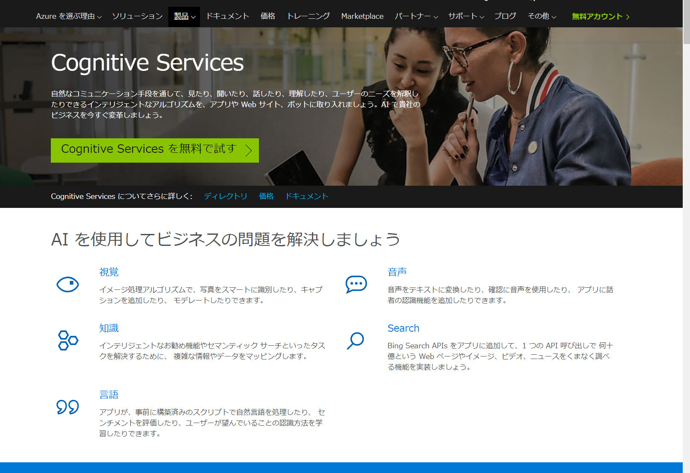
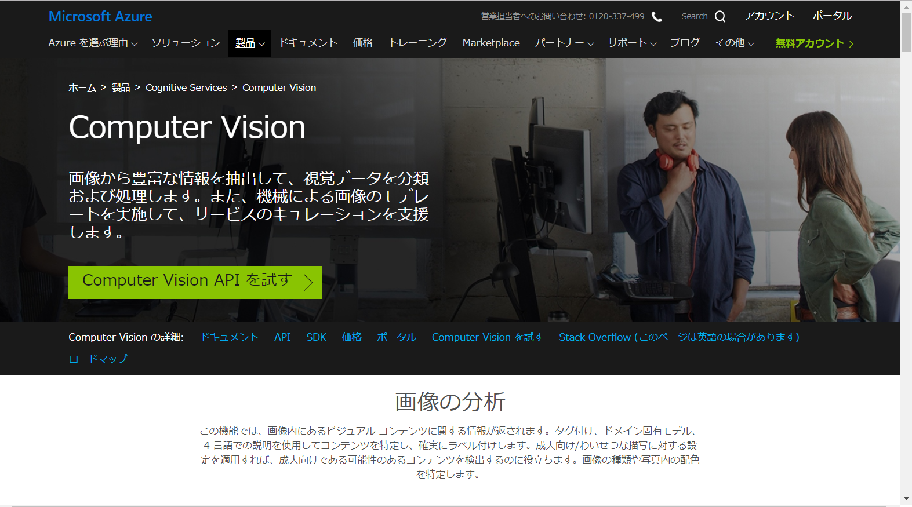
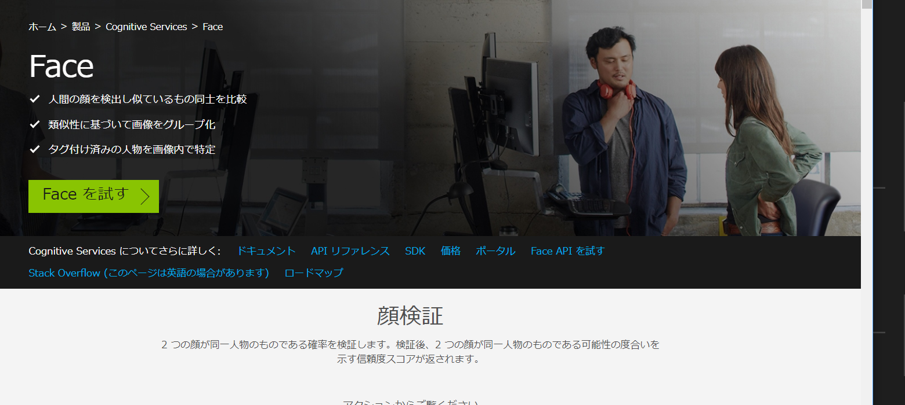
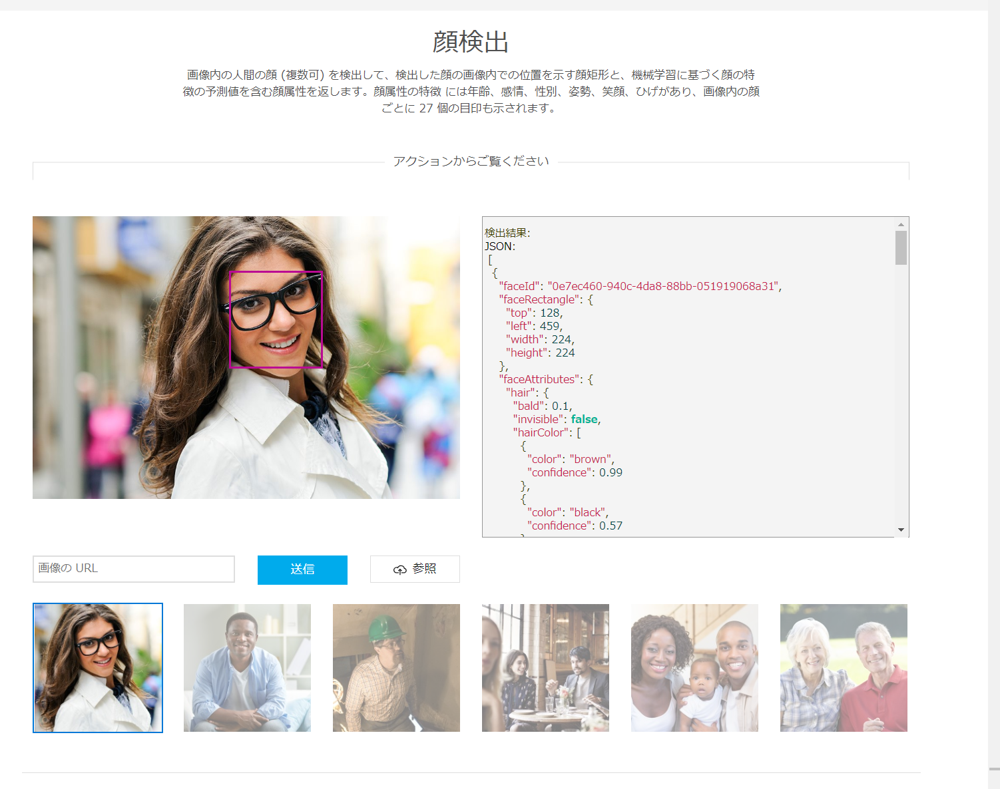
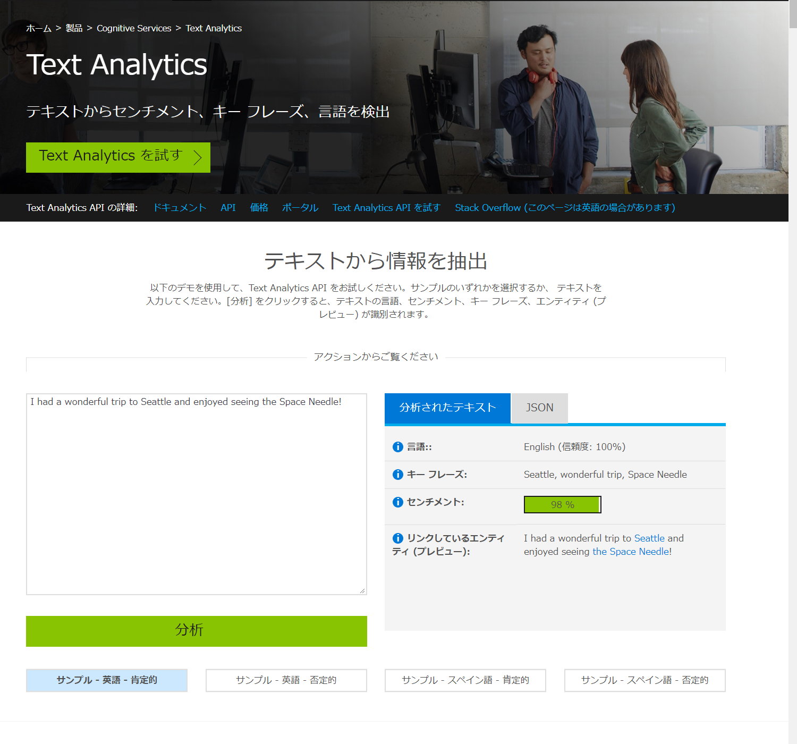
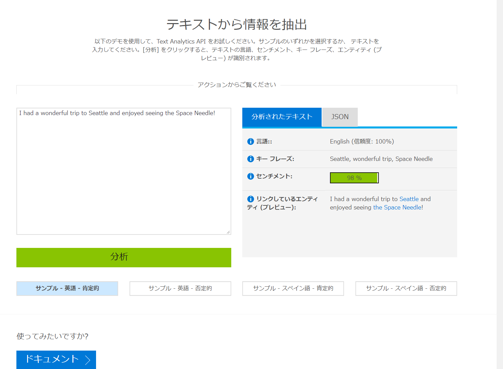

# Cognitive Services 全体を俯瞰する

[Microsoft Cognitive Services](https://microsoft.com/cognitive) は、画像の認識や自然言語の分析などの **AI 機能 (認知機能)** をマイクロソフトが Web サービスとして公開したものです。

AI 機能を開発する (＝学習モデルを開発する) には、統計や数学、機械学習についての専門知識と大量の学習データが必要です。

Cognitive Services は学習済みモデルです。モデル開発の時間と費用とをかけずに AI 機能を「利用する」ことができます。  

***

## Cognitive Services の全体像

2018年6月現在、Cognitive Services の各機能は、5つのカテゴリーに分類されています。

| カテゴリー | 機能の内容 |
|---|---|
| [**視覚**](https://azure.microsoft.com/ja-jp/services/cognitive-services/directory/vision/) | 画像や動画を解析して、分類したり特徴を抽出したりする機能など |
| [**音声**](https://azure.microsoft.com/ja-jp/services/cognitive-services/directory/speech/) | テキストと音声との双方向の変換機能や翻訳機能など |
| [**言語**](https://azure.microsoft.com/ja-jp/services/cognitive-services/directory/lang/) | テキストの意味を解釈する機能や音声による指示を理解する機能など |
| [**知識**](https://azure.microsoft.com/ja-jp/services/cognitive-services/directory/search/) | 自然言語を使った質問から適切な回答を導き出す機能 |
| [**検索**](https://azure.microsoft.com/ja-jp/services/cognitive-services/directory/search/) | Web ページや画像、ニュースを検索する機能など |

Cognitive Services のサイトには、各機能のデモが用意されています。

以下では、代表的な機能について実際にデモを操作してみます。  

***

## Computer Vision

[Computer Vision](https://azure.microsoft.com/ja-jp/services/cognitive-services/computer-vision/) は、画像の内容を解析する機能です。

- 人の顔を認識して、年齢、性別、感情
- 画像に含まれる要素や画像全体の簡潔な説明文
- 画像の特徴的なサムネイル
- 画像に移っている著名人の情報
- OCR (手書き文字のテキスト化) ※2018年6月時点では英語のみ

---
### 画像の分析

実際に、画像を分析してみます。

1. [Computer Vision のページ](https://azure.microsoft.com/ja-jp/services/cognitive-services/computer-vision/) を開きます。
2. **画像の分析** の位置までスクロールします。

3. 表示されている **サンプル画像** をクリックします。
4. 画像の右側の領域に分析結果が表示されます。**"tags"** には画像に含まれる対象が表示されます(最初に表示されている駅のホームの画像では、"train", "platform", "station" など)。 **"captions"** には画像の説明が表示されます(例: "people waiting at a train station")。 **"confidence"** には画像の説明の確度 (どのくらい信頼してよさそうか) が表示されます(例: 0.833099365)。
5. ネット上の画像を検索して、アドレスを **"画像の URL"** に貼り付けます。送信ボタンをクリックすると、その画像の分析結果が表示されます。
6. PC に保存している画像があれば、**"参照" ボタン** をクリックして、画像ファイルを選択します。画像がクラウドにアップロードされて、分析結果が表示されます。

人の顔が含まれる画像の場合は、**年齢・性別・感情などと顔の位置** も合わせてされます。

 
**考察**  
どんな画像だと分析結果の確度が低くなると思いますか。予想して、ネットで確度が低くなりそうな画像を探してみてください。   

***
## Face

[Face](https://azure.microsoft.com/ja-jp/services/cognitive-services/face/) は、人の顔に特化した画像分析機能です。

- 顔の位置、性別、年齢、感情、髪の色や帽子などを被っているか、感情
- 2枚の写真が同じ人物であるか
- 似た顔の検索や類似性を元にしたグループ化

  

---
### 顔検証

1. [Face のページ](https://azure.microsoft.com/ja-jp/services/cognitive-services/face/) を開きます。
2. **顔検出** の位置までスクロールします。

3. 表示されている **サンプル画像** をクリックします。
4. 画像の右側の領域に検出結果が表示されます。顔の位置、髪の色、性別、年齢、眼鏡の有無、化粧の状態が表示されます。
5. ネットで人の顔を検索して、アドレスを **"画像の URL"** に貼り付けます。送信ボタンをクリックすると、その画像の検出結果が表示されます。
6. PC に保存している画像があれば、**"参照" ボタン** をクリックして、画像ファイルを選択します。画像がクラウドにアップロードされて、検出結果が表示されます。

**考察**  
PC のカメラを使って、顔を傾ける、斜め横を向くなどして、顔を検出できるか確認してください。
また顔の一部を手で隠すと、どうなりますか。   

***
## Text Analytics

[Text Analytics](https://azure.microsoft.com/ja-jp/services/cognitive-services/text-analytics/) は、テキストから情報を抽出する機能です。

- 言語
- キーフレーズ (文章中で大事な語句)
- 感情

---
### テキストから情報を抽出

1. [Text Analytics のページ](https://azure.microsoft.com/ja-jp/services/cognitive-services/text-analytics/) を開きます。
2. **テキストから情報を抽出** の位置までスクロールします。

1. 日本語の文章を入力して、 **分析** をクリックします。
2. 言語は日本語であること、キーフレーズ、この文章の感情が表示されます。
3. **サンプル - 英語 - 肯定的** をクリックします。
4. 言語は英語であること、キーフレーズ、センチメント (この文章の感情) が表示されます。感情については日本語よりも広い範囲の数値をとることがわかります。
5. **サンプル - 英語 - 否定的** をクリックします。
6. 言語は英語であること、キーフレーズ、センチメントが表示されます。センチメントのスコアが低いことが分かります。

**考察**
英語に比べて、日本語の文章はセンチメントの数値の振れ幅が少ない傾向があります。なぜだと思いますか？   

***
Cognitive Services 全体を紹介しました。
またその中でも、比較的よく使われて、簡単に結果が分かりやすい機能について、実際にデモページで操作しました。

AI についての技術的な知識がなくても、簡単に Cognitive Services を利用できることが分かったと思います。