# Custom Vision で特定分野の画像解析に強くなる

[Custom Vision](https://azure.microsoft.com/ja-jp/services/cognitive-services/custom-vision-service/) は、画像分析を特定の用途向けにカスタマイズする機能です。

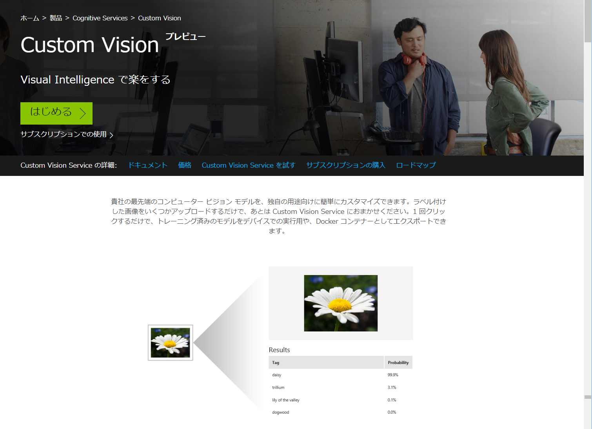

  

---
## Custom Vision が有用なケース

例として、以下の画像を [Computer Vision](https://azure.microsoft.com/ja-jp/services/cognitive-services/computer-vision/) で分析してみます。

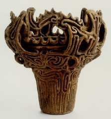
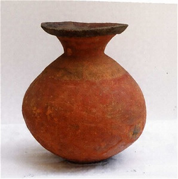

最初の画像は "a pair of chain" と分析されました。"confidence" は 0.5 程度で、あまり自信がなさそうです。実際、間違った答えを返しています。 
二つ目の画像は、"a vase sitting on a table" と分析されました。"confidence" は 0.5 程度です。こちらは間違いとはいえませんが、期待した答えからは遠いようです。

※Computer Vision の学習モデルは随時更新されます。その時により Caption や Confidence の値は異なるかもしれません。

---
これらの画像を "縄文土器"、"弥生土器" として認識してほしい場合に、Custom Vision を利用します。

実際に Custom Vision を試してみます。

※Custom Vision を試すには、マイクロソフトアカウントまたは Azure Subscription が必要です。 
本ワークショップでは、マイクロソフトアカウント取得の手順は紹介しません。アカウントを持ってない場合は、**[こちらのページ](https://www.microsoft.com/ja-jp/msaccount/signup/default.aspx)** を参考にアカウントを取得してください。   

***
## Custom Vision の学習モデルの作成

1. 学習用画像の取得します。  
[このリポジトリ (https://github.com/seosoft/CognitiveWorkshop)](https://github.com/seosoft/CognitiveWorkshop) にサンプル画像を含んでいます。 
"Clone or download" から "Download ZIP" を選択して、リポジトリをダウンロードします。ダウンロード後に、ローカル PC の任意の場所に ZIP ファイルを展開すれば、サンプル画像が得られます。(SampleData\CustomVision フォルダー)

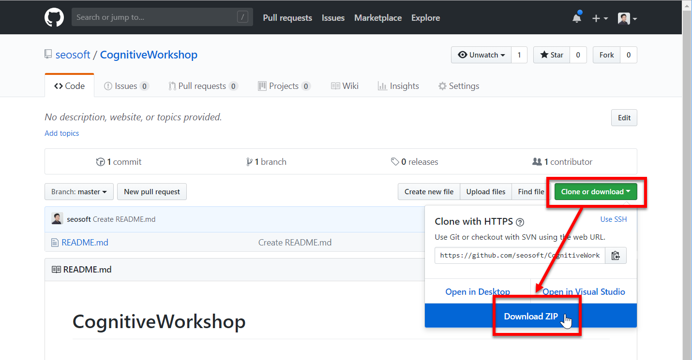

2. [Custom Vision のページ](https://customvision.ai/) を開いて、**"SIGN IN"** をクリックします。 マイクロソフトアカウントでサインしてください。

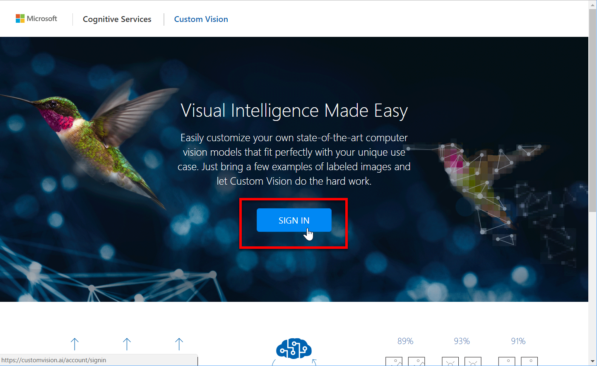

3. "Projects" ページが開いたら、**"New Project"** をクリックします。
4. 以下の内容で Custom Vision のプロジェクトを作成します。最後に **"Create project"** をクリックします。
    - Name ・・・任意の名前
    - Project Type ・・・ "Classification" : 画像の分類をすることを意味します。
    - Domains ・・・ "General" : 一般的な画像であることを意味します。食べ物、建物などは適切なドメインを選択するといいようです。

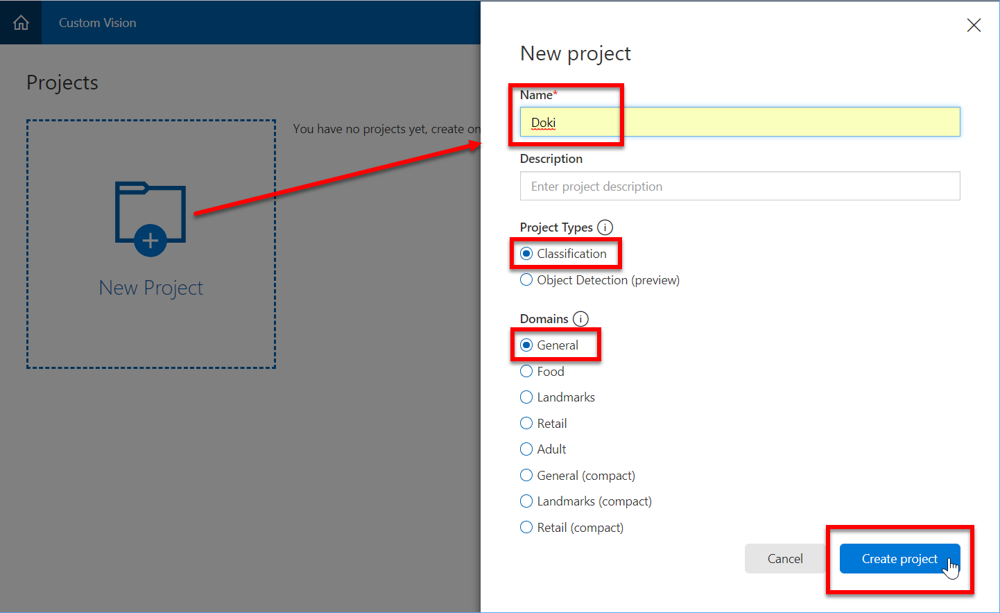

5. **"TRAINING IMAGES"** の **左肩の "+"** ボタン、または中央の **"Add Images"** をクリックします。

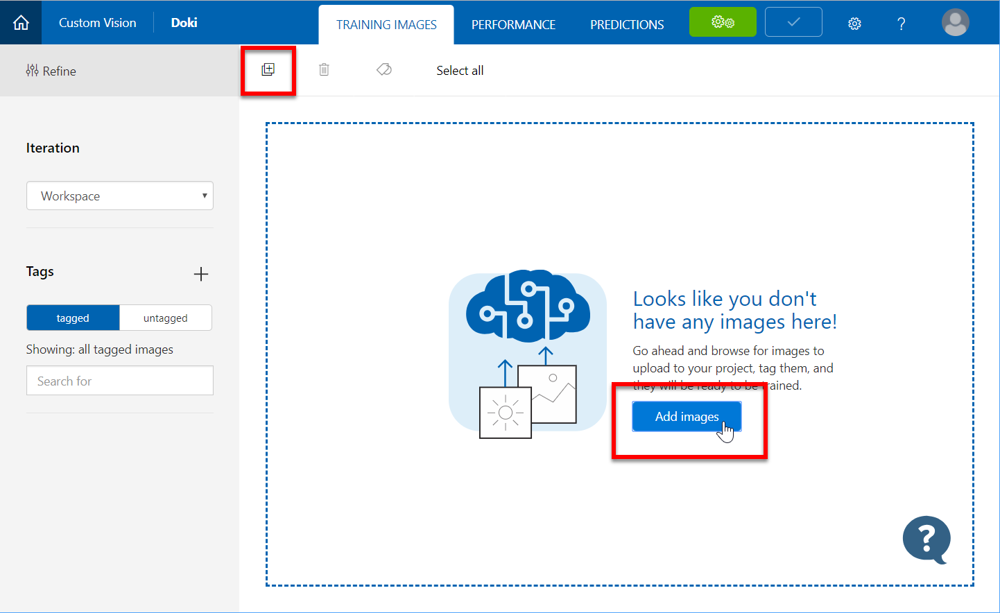

6. **"Browse local files"** をクリックして、学習させる画像ファイル (教師データ) を選択します。  
ここではリポジトリを展開したものから "SampleData\CustomVision\Doki\Jomon" フォルダーの全てのファイルを選択します。

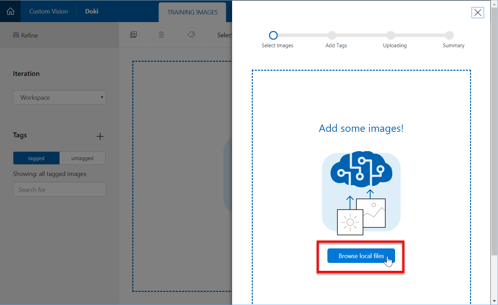
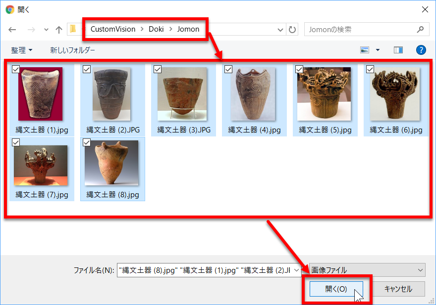

7. 選択した画像ファイルに **タグ** を付けます。ここでは **"Jomon"** とします。続いて "Upload n files" をクリックします。

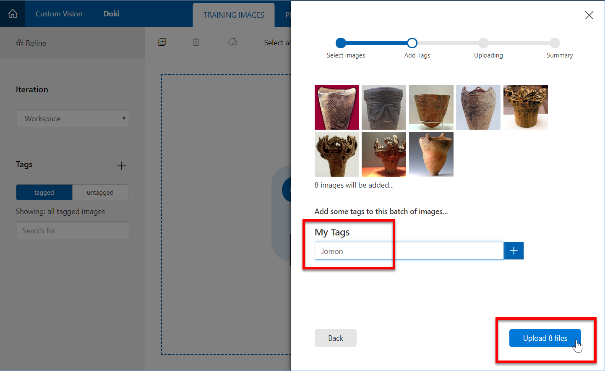

8. 同じ手順で "SampleData\CustomVision\Doki\Yayoi" フォルダーの全てのファイルをアップロードします。  
ここでは、タグは **"Yayoi"** とします。
9. もしタグをつけ忘れた場合、または間違ったタグを付けてしまった場合は、アップロード後にタグを変更することができます。  
"TRAINING IMAGES" に表示されている画像で、タグをつけ忘れた、または間違ったタグをつけた **画像を選択** します。続いて、**正しいタグ** を指定して "Save and close" をクリックします。

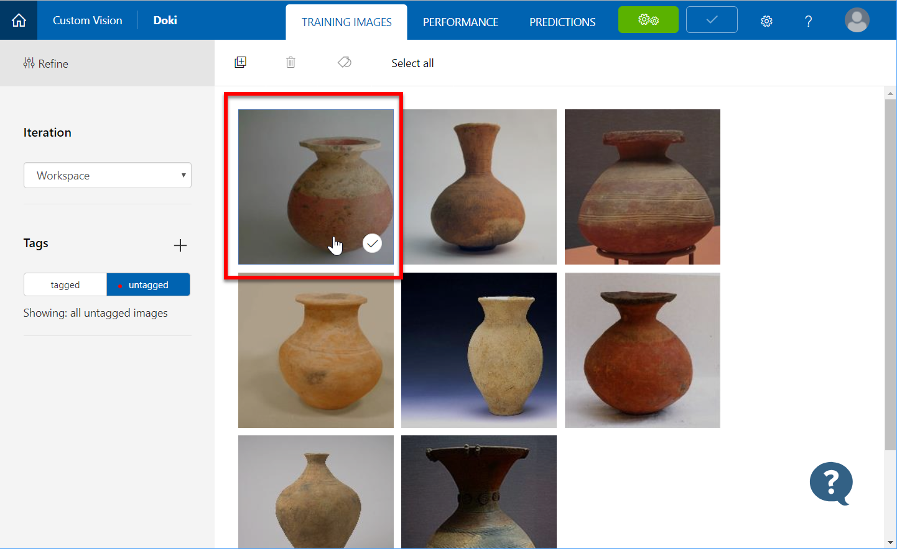
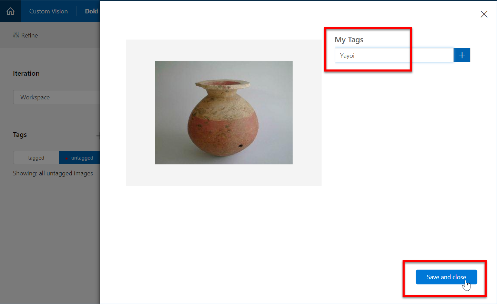

10. アップロードした画像を学習します。  
**"Train"** ボタンをクリックして学習を開始します。少し待つと **"PERFORMANCE"** 画面が自動的に表示されて、学習が完了したことが分かります。  
**Precision** および **Recall** の値を見ると、今回の画像は非常に高い割合で分類できたことが分かります。**「賢い」 AI** だと言えそうです。

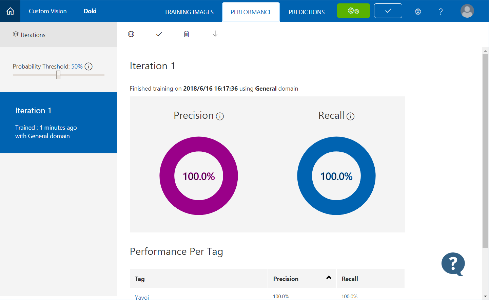

  

| 指標 | 意味 |
|---|---|
| Precision | それぞれに分類したもののうち、実際に事前にそのタグが付いていた画像の割合。  例えば "Jomon" に分類された画像のうち、実際に "Jomon" タグがを付けてアップロードした画像の割合 |
| Recall | 事前に付いていたタグ通りに分類された画像の割合。  例えば "Jomon" タグを付けてアップロードした画像のうち、実際に "Jomon" に分類された画像の割合 |

11. **未知の画像** (学習に使っていない画像) を、学習モデルに適用してみます。  
**"Quick Test"** をクリックします。 
**"Browse local file"** をクリックして、"SampleData\CustomVision\Doki\Predict" フォルダーの画像を 1つ選びます。  
またはネットで画像を探して "Enter Image URL" にアドレスを入力してもかまいません。  
例えば以下の画像だと、99.9% "Jomon" だと予測されました。

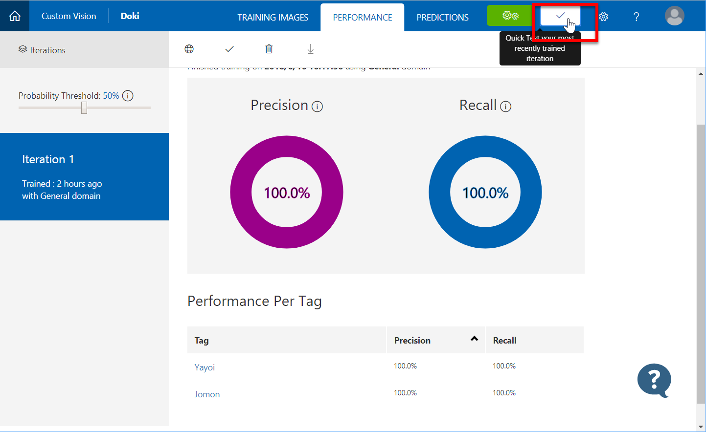

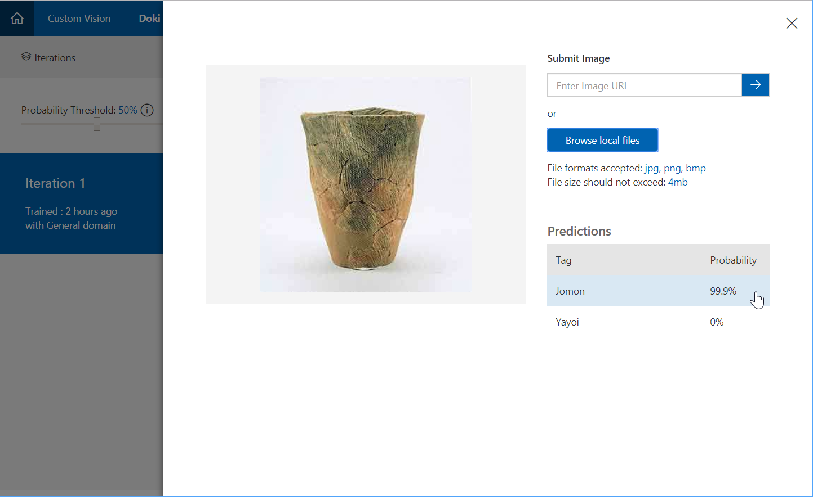

  
**考察**  
例えば、人の顔などの画像を適用した場合、どのような結果が返されるでしょうか。   

***
## 別の学習モデル

**別の学習モデル** を作って、精度に違いが出ることを確認してみます。

同様の手順で、"SampleData\CustomVision\Token" フォルダーの画像を学習してみます。

1. Custom Vision のホームページで、"New Project" を選択して、新しいプロジェクトを作成します。 
ここでは "Token" (刀剣の意味) とします。
2. "SampleData\CustomVision\Token\Tachi" フォルダー内の画像を **"Tachi"** タグでアップロードします。
3. "SampleData\CustomVision\Token\Katana" フォルダー内の画像を **"Katana"** タグでアップロードします。
4. Custom Vision のメニューで **"Train"** を選択して、アップロードした画像を学習します。
5. 学習結果を見ます。  
先ほどの学習モデルと比べて、"Precision"、"Recall" とも数値が低いことが分かります。 
特に、"Tachi" タグのほうが数値が低くなっています。

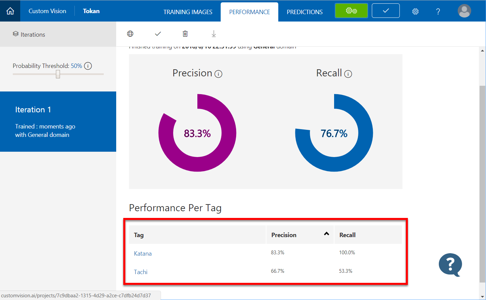

1. 未知の画像 (学習に使っていない画像) を、学習モデルに適用してみます。  
"SampleData\CustomVision\Token\Predict" フォルダーの画像を使います。 
前の手順でも分かる通り、"太刀" の画像が正しく認識できないことが多いことが確認できます。

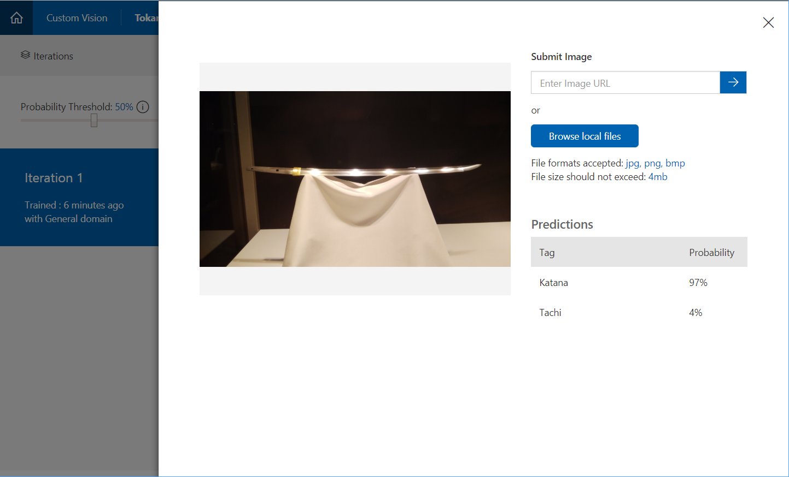

  
**考察**  
前のプロジェクトと比べて、数値が低いこと、また未知の画像の解析も間違いが多い理由は何だと思いますか。  
また、学習モデルを賢くするには、どのようにしたらいいと思いますか。
  

***
以上で、Custom Vision の学習の手順が分かったと思います。

認識したい画像が明確であれば、Custom Vision を使って非常に低コストで画像の分類ができます。   

今回のワークショップでわかったように、現在の AI は決して万能ではありません。  
どのような用途で使えそうか、より賢くするにはどうしたらいいかをよく考えながら利用するとよいでしょう。
